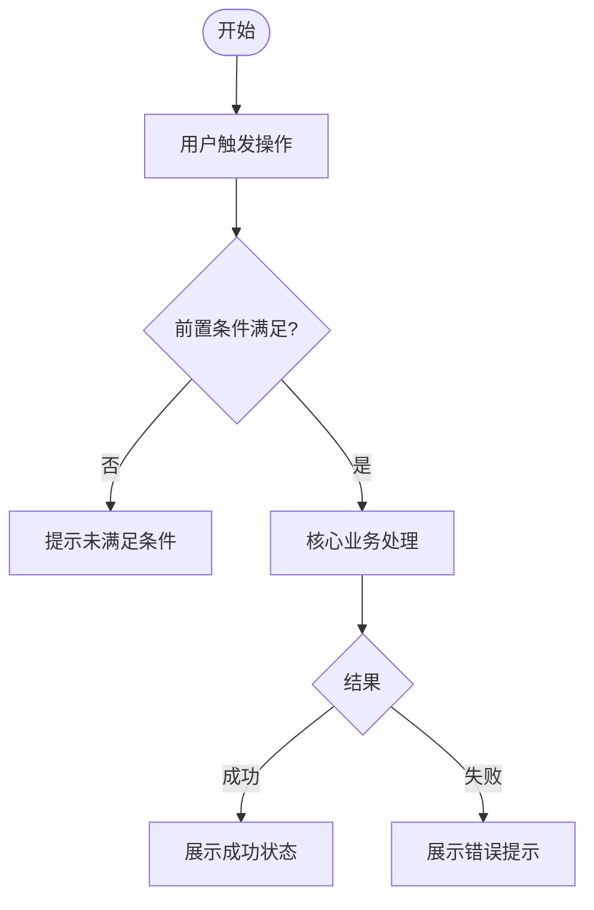
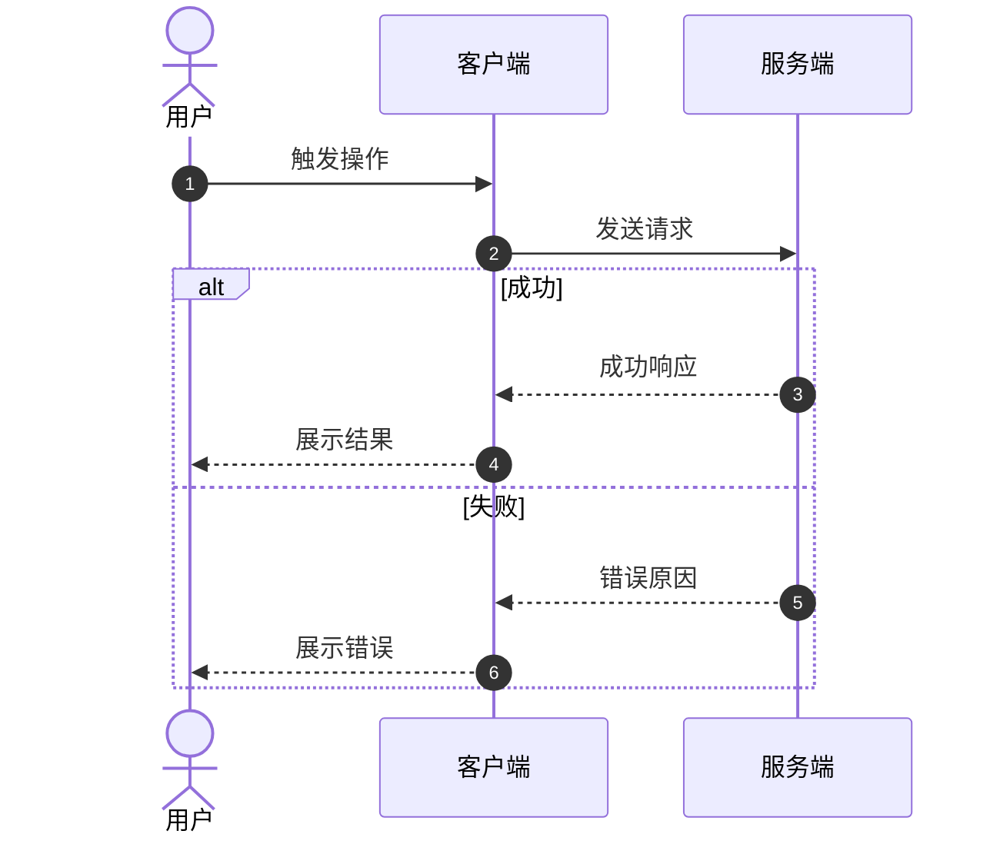

# PRD - [功能名称]

> **所属模块**: M[编号]-[模块名] | **功能编号**: F[编号] | **优先级**: P0/P1/P2

---

> 本文档描述**做什么**（业务规则、验收标准），不涉及技术实现。  
> 技术规格（DB+API+测试）见 [tdd.md](./tdd.md)。

---

## 1. 功能说明

**一句话描述**: [为 [用户角色] 提供 [核心能力]，以便 [业务价值]]

**使用场景**:
| 场景 | 用户角色 | 触发条件 |
|------|----------|----------|
| [场景1] | [角色] | [条件] |

**功能依赖**:
| 方向 | 功能 | 依赖内容 |
|------|------|----------|
| 本功能依赖 | [F[编号]-功能名] | [依赖的数据/能力] |
| 被谁依赖 | [F[编号]-功能名] | [提供的数据/能力] |

---

## 2. 业务流程

### 主流程



### 时序图（业务视角）

> 本图描述**用户与系统的交互**，关注"谁做了什么"。技术实现细节（缓存、DB、内部调用链）见 [tdd.md](./tdd.md) 的技术时序图。



---

## 3. 业务规则

### 前置条件
| 条件 | 不满足时的处理 |
|------|---------------|
| [条件1] | [提示/跳转/禁用] |

### 输入与校验
| 字段名 | 必填 | 校验规则 | 错误提示 |
|--------|------|----------|---------|
| [字段1] | 是 | 长度1-50 | "请输入1-50个字符" |
| [字段2] | 否 | 数值0-100 | "请输入0到100之间的数值" |

### 规则定义

**规则1: [规则名称]**
```
WHEN [触发条件]
THEN [满足条件时的业务动作]
ELSE [不满足条件时的业务动作]
```

**示例（订单取消规则）**:
```
WHEN 订单状态为"待支付" AND 下单时间距今 < 30分钟
THEN 允许用户取消订单，状态变更为"已取消"
ELSE 提示"订单已超过可取消时限"，禁止取消操作
```

### 权限控制
| 操作 | 允许的角色 |
|------|-----------|
| 查看 | [角色A、角色B] |
| 编辑 | [角色A] + 数据创建人 |
| 删除 | [管理员] |

---

## 4. 异常与边界

| 场景 | 用户看到的提示 | 处理方式 |
|------|---------------|----------|
| 输入不合法 | 字段下方红色提示 | 按提示修改后重提 |
| 业务限制 | 弹窗说明限制原因 | 调整操作 |
| 并发冲突 | "数据已更新，请刷新" | 刷新后重操作 |
| 服务不可用 | "服务繁忙，请稍后重试" | 等待重试 |
| 列表为空 | 展示引导性空状态 | 新增数据 |
| 重复提交 | 按钮禁用防重复 | 等待完成 |

---

## 5. 验收标准

- [ ] 正常主流程：[预期结果]
- [ ] 异常场景：[预期表现]
- [ ] 边界情况：[预期表现]
- [ ] 权限控制：无权限用户无法执行对应操作
- [ ] 性能：主要操作响应在 [X]s 内
