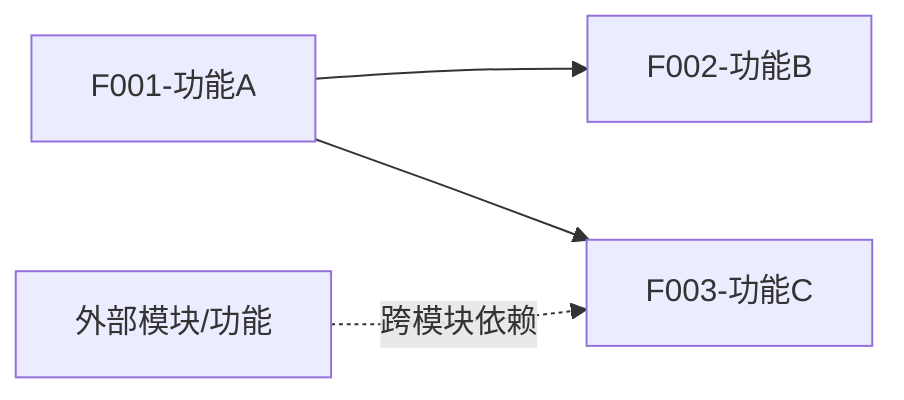

# M[编号] - [模块名称]

> **模块编号**: M[编号]
> **创建日期**: [YYYY-MM-DD]

---

## 1. 模块概述

**业务背景**: [该模块解决的核心业务问题]

**模块目标**:
- [目标1]
- [目标2]

---

## 2. 模块边界

### 依赖关系
| 方向 | 模块 | 依赖内容 | 强/弱 |
|------|------|----------|-------|
| 本模块依赖 | M[编号]-[模块名] | [依赖的业务能力] | [强/弱] |
| 被谁依赖 | M[编号]-[模块名] | [提供的业务能力] | [强/弱] |

### 对外提供的能力
- [能力1]: [描述]
- [能力2]: [描述]

---

## 3. 功能清单与依赖

| 功能编号 | 名称 | 优先级 | 文档 |
|----------|------|--------|------|
| F001 | [功能名] | P0 | [prd.md](./F001-[功能名]/prd.md) |
| F002 | [功能名] | P1 | [prd.md](./F002-[功能名]/prd.md) |

### 功能依赖关系图

> 实线=本模块内依赖，虚线=跨模块依赖

---

## 4. 质量目标

| 维度 | 目标 |
|------|------|
| 性能 | [核心操作 < Xs] |
| 可用性 | [99.X%] |
| 降级策略 | [当依赖模块不可用时的处理] |
