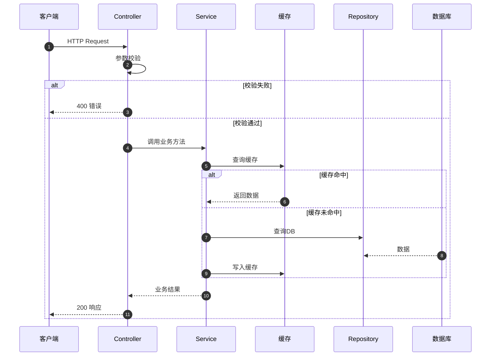
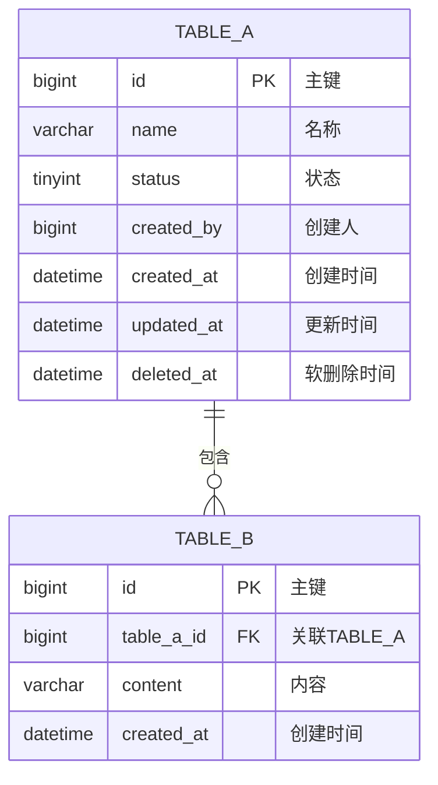

# TDD - {功能名称}

> **所属功能**: F{编号}-{功能名} | **所属模块**: M{编号}-{模块名}  
> **技术栈**: {后端框架} / {数据库} / {缓存}

---

## 1. 技术方案

### 实现思路
[从技术角度描述如何实现，重点在关键决策和实现路径]

### 技术时序图



### 依赖关系

| 功能/服务 | 类型 | 依赖内容 | 不可用时 |
|-----------|------|----------|----------|
| [F{编号}-{名}] | 内部 | [数据/接口] | [降级策略] |
| [外部服务] | 外部 | [能力] | [熔断/降级] |

---

## 2. 数据库设计

### ER 图



### 表定义

#### {table_name} 表

**用途**: [业务含义] | **预估数据量**: [X万→X百万] | **读写比**: 读X%/写X%

```sql
CREATE TABLE `{table_name}` (
  `id`           BIGINT       NOT NULL AUTO_INCREMENT COMMENT '主键',
  `name`         VARCHAR(100) NOT NULL                COMMENT '名称',
  `status`       TINYINT      NOT NULL DEFAULT 1      COMMENT '状态: 1=启用 0=禁用',
  `config`       JSON                                 COMMENT '扩展配置',
  `created_by`   BIGINT       NOT NULL                COMMENT '创建人用户ID',
  `updated_by`   BIGINT       NOT NULL                COMMENT '更新人用户ID',
  `created_at`   DATETIME     NOT NULL DEFAULT CURRENT_TIMESTAMP COMMENT '创建时间',
  `updated_at`   DATETIME     NOT NULL DEFAULT CURRENT_TIMESTAMP ON UPDATE CURRENT_TIMESTAMP COMMENT '更新时间',
  `deleted_at`   DATETIME                             COMMENT '软删除时间',
  PRIMARY KEY (`id`),
  UNIQUE KEY `uk_{table}_name` (`name`, `deleted_at`),
  KEY `idx_{table}_status` (`status`, `deleted_at`),
  KEY `idx_{table}_created_at` (`created_at`)
) ENGINE=InnoDB DEFAULT CHARSET=utf8mb4 COLLATE=utf8mb4_unicode_ci COMMENT='{业务说明}';
```

**字段说明**:

| 字段 | 类型 | 约束 | 说明 |
|------|------|------|------|
| id | BIGINT | PK | 主键 |
| name | VARCHAR(100) | Not Null, Unique | [含义] |
| status | TINYINT | Not Null, Default 1 | 1=启用, 0=禁用 |
| config | JSON | Nullable | 结构见下方 |
| deleted_at | DATETIME | Nullable | NULL=未删除 |

**索引设计**:

| 索引名 | 字段 | 类型 | 适用查询 |
|--------|------|------|----------|
| uk_name | name, deleted_at | 唯一 | 名称唯一 |
| idx_status | status, deleted_at | 普通 | 状态过滤 |
| idx_created_at | created_at | 普通 | 时间范围 |

### 枚举值

| 字段 | 值 | 含义 |
|------|----|------|
| status | 1 | 启用 |
| status | 0 | 禁用 |

### JSON 字段结构

**config**:
```json
{"key1": "value", "key2": 100}
```

| 键 | 类型 | 必填 | 说明 |
|----|------|------|------|
| key1 | string | 否 | [说明] |

### 数据关系

> 不使用数据库级外键，应用层保证一致性。主表用 `deleted_at` 软删除。

### Migration 规范
- 命名: `V{版本}_{日期}__{操作}.sql`
- 使用 `CREATE TABLE IF NOT EXISTS`
- 大表 DDL 用 online DDL 工具

---

## 3. 接口定义

### 通用规范

**请求头**:
```
Content-Type: application/json
Authorization: Bearer {access_token}
X-Request-ID: {uuid}
```

**统一响应格式**:
```json
// 成功
{"code": 0, "message": "success", "data": {}}

// 错误
{"code": 100001, "message": "参数错误: xxx 不能为空"}

// 分页
{"code": 0, "data": {"list": [], "total": 100, "page": 1, "pageSize": 20}}
```

### 接口总览

| 编号 | 方法 | 路径 | 描述 | 认证 |
|------|------|------|------|------|
| API-01 | POST | `/api/v1/{模块}/{资源}` | [描述] | 需要 |
| API-02 | GET | `/api/v1/{模块}/{资源}/:id` | [描述] | 需要 |
| API-03 | GET | `/api/v1/{模块}/{资源}` | [分页列表] | 需要 |
| API-04 | PUT | `/api/v1/{模块}/{资源}/:id` | [描述] | 需要 |
| API-05 | DELETE | `/api/v1/{模块}/{资源}/:id` | [描述] | 需要 |

### API-01: {接口名称}

| 项目 | 内容 |
|------|------|
| 方法 | `POST` |
| 路径 | `/api/v1/{模块}/{资源}` |
| 描述 | [一句话] |
| 权限 | [角色/权限点] |
| 限流 | [X]次/秒 |

**Request Body**:
```json
{
  "fieldA": "string",
  "fieldB": 123
}
```

| 字段 | 类型 | 必填 | 校验 | 说明 |
|------|------|------|------|------|
| fieldA | string | 是 | 长度1-50 | [说明] |
| fieldB | integer | 否 | 0-1000 | [说明] |

**成功响应**:
```json
{"code": 0, "data": {"id": "123456", "createdAt": "2024-01-01T00:00:00Z"}}
```

**幂等性**: [唯一业务键 / requestId / 无]

> 其余接口按相同格式定义。列表接口需定义 page/pageSize/keyword/status 等 Query 参数。

---

## 4. 错误码

> 规范：前3位模块编号，后3位功能序号

| 错误码 | HTTP | 描述 | 触发场景 |
|--------|------|------|----------|
| 100001 | 400 | 参数错误 | 校验失败 |
| 100003 | 403 | 权限不足 | 无权限 |
| 100004 | 404 | 资源不存在 | ID无效 |
| 100500 | 500 | 服务内部错误 | 系统异常 |

---

## 5. 性能设计

### 缓存策略
| 缓存键 | 数据 | TTL | 更新时机 |
|--------|------|-----|----------|
| `{prefix}:{id}` | [描述] | [Xs] | [写入/更新时删除] |

### 并发控制
| 场景 | 方式 | 方案 |
|------|------|------|
| 重复提交 | 幂等 | [唯一索引/Redis锁] |
| 并发更新 | 乐观锁 | [version字段] |

### 分页
- [offset / cursor]，超 [X] 条时 [异步/分批]

---

## 6. 安全设计

| 维度 | 方案 |
|------|------|
| 认证 | JWT Bearer Token |
| 敏感字段 | [脱敏/加密] |
| SQL注入 | ORM参数化查询 |
| 防重放 | [requestId/唯一键] |

---

## 7. 测试用例

### 单元测试
| 测试目标 | 输入 | 预期结果 |
|----------|------|----------|
| [Service.方法名] | [正常参数] | [预期输出] |
| [Service.方法名] | [边界值] | [预期错误] |

### 集成测试
| 场景 | 步骤 | 验证点 |
|------|------|--------|
| 正常主流程 | [步骤] | [验证内容] |
| 异常场景 | [步骤] | [验证错误码] |

### 边界测试
| 条件 | 输入 | 预期 |
|------|------|------|
| 最小值 | [min] | [通过/失败] |
| 最大值 | [max] | [通过/失败] |
| 空值 | null | [错误信息] |
| 并发 | [X并发] | [幂等/限流] |

### 性能测试
| 指标 | 目标 | 方法 |
|------|------|------|
| P99 | < Xms | [压测工具] |
| 吞吐量 | X QPS | [场景] |

---

## 8. 部署注意

- [ ] 执行上述 DDL 建表脚本
- [ ] 确认索引已创建
- [ ] 配置项：[config.key] = [default]
- [ ] 监控告警已配置
- [ ] 回滚方案已准备
