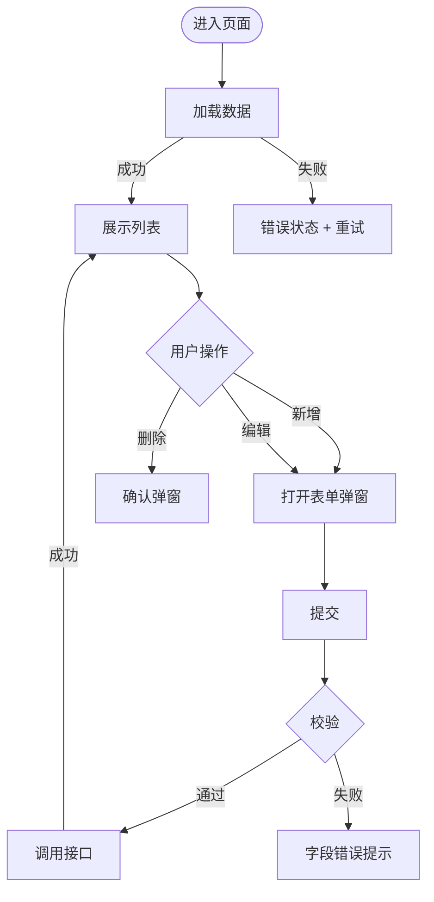

# UI - {功能名称}（可选文档）

> **所属功能**: F{编号}-{功能名} | **所属模块**: M{编号}-{模块名}  
> **前端框架**: {Vue3 / React / 小程序}  
> **UI组件库**: {Element Plus / Ant Design / Tailwind}

> **何时需要此文档**: 功能有用户界面时生成。纯后台任务、定时任务等不需要。

---

## 1. 页面清单

| 编号 | 页面/视图 | 路由 | 组件名 |
|------|----------|------|--------|
| UI-01 | [页面名] | `/path` | `XxxPage.vue` |
| UI-02 | [弹窗名] | - | `XxxModal.vue` |

---

## 2. 交互流程



---

## 3. 页面布局

### UI-01: {页面名}
```
+---------------------------------------------+
|  标题                           [新增按钮]    |
+---------------------------------------------+
|  [搜索] [筛选项] [筛选项]    [重置] [搜索]    |
+---------------------------------------------+
|  列1    列2    列3    列4    操作             |
|  数据                        [编辑] [删除]    |
+---------------------------------------------+
|  共 X 条    < 1 2 3 >                        |
+---------------------------------------------+
```

### UI-02: {弹窗名}
```
+--------------------------------+
|  标题                      [x] |
+--------------------------------+
|  字段A *  [__________________] |
|  字段B    [______________  v ] |
|  字段C *  [__________________] |
+--------------------------------+
|            [取消]  [确认提交]   |
+--------------------------------+
```

**表单字段**:
| 字段 | 组件 | 必填 | 校验 |
|------|------|------|------|
| 字段A | Input | 是 | 长度1-50 |
| 字段B | Select | 否 | 枚举选择 |
| 字段C | Textarea | 是 | 长度1-500 |

---

## 4. 状态定义

| 状态 | 表现 |
|------|------|
| 首次加载 | 骨架屏 |
| 刷新/翻页 | 表格内 Loading |
| 提交中 | 按钮 Loading + 禁用 |
| 列表为空 | 引导性空状态 + 新增按钮 |
| 搜索无结果 | "没有找到相关内容" + 清空筛选 |
| 接口报错 | Toast红色提示 |
| 操作成功 | Toast绿色提示 2s |

---

## 5. 权限控制

| 操作 | 权限 | 无权限时 |
|------|------|----------|
| 查看 | [permission.list] | 403页面 |
| 新增 | [permission.create] | 按钮隐藏 |
| 编辑 | [permission.update] | 按钮隐藏 |
| 删除 | [permission.delete] | 按钮隐藏 |
